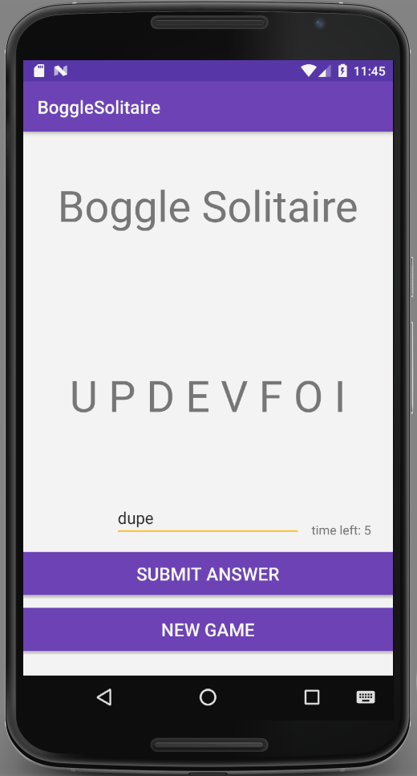
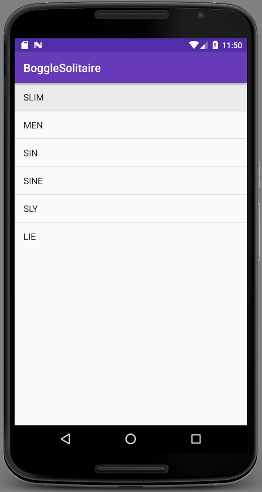

# Boggle Solitaire

#### Boggle Solitaire, Sept 2017

#### By Trevor Gill

## Description
_A solitaire version of boggle (similar to Text Twist). The user is given 8 random letters and they are tasked with submitting words that can be made out of letters in the random array of letters. The user tries to submit as many valid English words as they can before time runs out.

## Setup/Installation Requirements
* Clone the repo
* Open the project in Android Studio
* Run MainActivity.java in the emulator

## Specifications
| Behavior      | Input      | Output       |
| ------------- | ---------- | ------------ |
| The application shall be able to generate a random series of 8 letters with atleast 2 vowels | New Game | Array of 8 letters | The application shall shall alert the user of incorrect or invalid answers | jump (but array doesn't have a "j") | Invalid answer | The application shall alert the user of correct answers | jump | "Good Answer!" | The application shall alert the user if they are submitting an answer that they have already submitted | jump | "Duplicate Answer | The application shall present the user with a list of valid answers after time has run out | Time runs out | list of valid answers submitted |

# Screenshot

# Potential Future Improvements
* Add 2nd player
* Add grid format of traditional Boggle game

## Technologies Used
* Android Studio

### License
Copyright &copy; 2017 Trevor Gill
